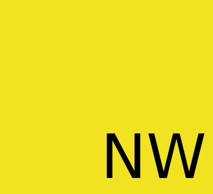

<p align="center"> 
 
</p>


 # Nw.js (Next Wagon.js) is A Lighweight Javascript Library for Form Validation

--------------------------------------------

<p align="center">
 <a href="https://github.com/fauzan121002/nwjs/LICENSE">
  
 </a>

 <a href="https://github.com/fauzan121002/nwjs">
  
 </a>
</p>

<p align="center">
 <a href="https://github.com/fauzan121002/nwjs/issues">
  
 </a>

 <a href="https://github.com/fauzan121002/nwjs">
  
 </a>

 <a href="https://github.com/fauzan121002/nwjs">
  
 </a>
</p>

--------------------------------------------
## Table of Contents

* [Usage](#usage)
* [Contributing](#contributing)
* [License](#license)

## Usage
You can see the example usage <a href="https://github.com/fauzan121002/nwjs/blob/master/example/index.html">here</a>

### How to use
You can import the script inside the body tag.
```html
 <!DOCTYPE html>
<html lang="en">
<head>
    <meta charset="UTF-8">
    <meta name="viewport" content="width=device-width, initial-scale=1.0">
    <title>nwjs</title>
</head>
<body>
    <form action="" method="post">
        <input type="text" placeholder="text">

        <button type="submit">Login</button>
    </form>    
    <script src="https://rawcdn.githack.com/fauzan121002/nwjs/4f297e676b946058d042f949abf5c5078503c6ea/freeview.js"></script>
</body>
</html>
```

Then just add "validate" attribute in your form tag
```html
    <form action="" method="post" attribute>
```

## Contributing
You can create new pull requests <a href="https://github.com/fauzan121002/nwjs/pulls">here</a>

## License
This javascript library is published under <a href="https://github.com/fauzan121002/nwjs/blob/master/LICENSE">MIT License</a>
